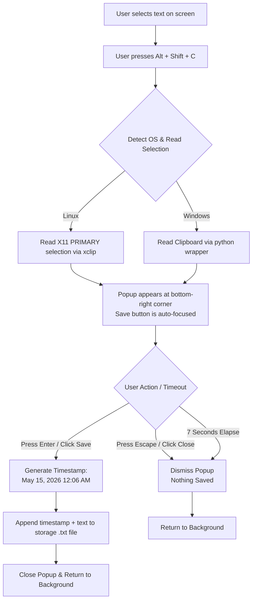

<div align="center">

<h1>
  
  <span>Keeppy</span>
</h1>

**Select. Press. Saved.**

[](https://www.python.org/)
[](https://github.com/)
[](LICENSE)
[]()
[]()

<br/>

*A tiny system tray tool that saves your selected text into a file — with one hotkey press.*

<br/>


</div>

---

## 🧾 Abstract

Keeppy is a lightweight desktop utility that runs silently in the system tray. When you select any text on your screen and press `Alt + Shift + C`, a small popup shows up asking if you want to save it. Hit Enter — done. The snippet gets saved to a plain `.txt` file with a timestamp. That's it. No cloud, no account, no bloat.

It works on both **Linux (GNOME)** and **Windows**, and it auto-starts when your laptop boots so you never have to think about running it manually.

---

## ❗ Problem Statement

You know that feeling when you're reading something on browser, or going through docs, and you find a line that you wanna save for later — but then you have to open Notepad, paste it, save, close... and do that 10 more times?

Yeah that's annoying.

Most people end up just leaving 40 browser tabs open, or dumping random stuff into a notes app that they'll never organize. There's no quick, keyboard-friendly way to just *grab a snippet and go*.

Keeppy solves that. You highlight, you press a hotkey, you press Enter. Everything lands in one `.txt` file with timestamps so you know when you saved what.

---

## 📖 Introduction

Keeppy started as a personal productivity problem. The goal was simple — make saving a copied piece of text as fast as possible, without switching windows or touching the mouse (mostly).

It runs as a background process with a system tray icon. First time you open it, it asks where you want to store your snippets. After that it remembers, and you never see a setup screen again.

A small popup appears bottom-right of your screen whenever you trigger the hotkey. The **Save button is auto-focused** so you just press `Enter` to confirm, or `Escape` to dismiss. The popup also disappears on its own after 7 seconds if you ignore it.

Everything is saved to a plain text file — readable by any editor, searchable, no special format. Just timestamped blocks of text stacked on top of each other.

> Built with Python — `tkinter` for the GUI, `pystray` for the tray icon, `keyboard` for the global hotkey, and `xclip` on Linux for reading selected text without needing Ctrl+C first.

---

## ⚙️ How It Works



### Timestamp format

Every snippet is saved in this format:

```
[May 15, 2026   12:06 AM]
The text you selected and saved goes here.

[May 15, 2026   12:09 AM]
Another snippet saved a few minutes later.

```

### System Tray

Keeppy lives in your system tray quietly. Right-click the icon to:
- Open **Settings** (change storage file location or clear all data)
- **Exit** the app

### Auto-start

After first-time setup, Keeppy registers itself to auto-launch on login:
- **Linux** → creates a `.desktop` file in `~/.config/autostart/`
- **Windows** → adds a registry entry under `HKCU\...\CurrentVersion\Run`

So even if your laptop restarts, Keeppy is already running when you log in.

---

## 💻 Installation

### Requirements

```bash
pip install pyperclip keyboard pillow pystray
```

On Linux you also need `xclip`:

```bash
sudo apt install xclip
```

### Run from source

**Linux:**
```bash
git clone https://github.com/Irshad-11/keeppy.git
cd keeppy
python -m venv venv
./venv/bin/pip install pyperclip keyboard pillow pystray
sudo ./venv/bin/python Keeppy.py
```

> [!NOTE]
> `sudo` is required on Linux because the `keyboard` library needs root access to listen for global hotkeys. Keeppy handles the clipboard access correctly even when running as root — it reads from your actual user session, not the root session.

**Windows:**
```powershell
git clone https://github.com/Irshad-11/keeppy.git
cd keeppy
python -m venv venv
venv\Scripts\pip install pyperclip keyboard pillow pystray
venv\Scripts\python Keeppy.py
```

> [!TIP]
> On Windows you don't need to run as Administrator. The `keyboard` library works fine as a regular user there.

---

## 📦 Download

> Pre-built binaries so you don't have to set up Python at all.

<div align="center">

| Platform | Download | Notes |
|----------|----------|-------|
| 🐧 Linux (Debian/Ubuntu) | [`keeppy_1.0.0_amd64.deb`](#) | Install with `sudo dpkg -i` |
| 🪟 Windows | [`Keeppy_Setup_1.0.0.exe`](#) | Run installer, launches on login |

</div>

### Linux `.deb` install

```bash
wget https://github.com/Irshad-11/keeppy/releases/download/v1.0.0/keeppy_1.0.0_amd64.deb
sudo dpkg -i keeppy_1.0.0_amd64.deb

# then run it
sudo keeppy
```

### Windows `.exe` install

1. Download `Keeppy_Setup_1.0.0.exe` from Releases
2. Run it (Windows might warn you — click "Run anyway", it's fine)
3. Keeppy starts automatically and sits in your system tray

> [!IMPORTANT]
> On Linux, the `.deb` install sets up auto-start for you. On Windows the installer does the same. Either way — once installed, you don't need to launch it manually ever again.

---

## 🗂️ File Structure

```
keeppy/
├── Keeppy.py          # main script
├── requirements.txt   # pip dependencies
├── README.md
└── LICENSE
```

Config file is stored at:
- **Linux:** `~/.keeppy_config.json`
- **Windows:** `C:\Users\<you>\.keeppy_config.json`

---

## 🛠️ Build it yourself

If you want to build the binary from source:

**Linux → `.deb`**
```bash
./venv/bin/pip install pyinstaller
sudo ./venv/bin/pyinstaller --onefile --name Keeppy \
    --hidden-import PIL._tkinter_finder Keeppy.py

# package as .deb (needs fpm)
sudo apt install ruby ruby-dev rubygems build-essential
sudo gem install fpm

fpm -s dir -t deb \
    -n keeppy -v 1.0.0 \
    --description "Keeppy - clipboard snippet saver" \
    dist/Keeppy=/usr/local/bin/keeppy

sudo dpkg -i keeppy_1.0.0_amd64.deb
```

**Windows → `.exe`** *(run this on a Windows machine)*
```powershell
pip install pyinstaller
pyinstaller --onefile --windowed --name Keeppy `
    --hidden-import PIL._tkinter_finder Keeppy.py
# find your exe at: dist\Keeppy.exe
```

> [!WARNING]
> Don't try to cross-compile the Windows `.exe` from Linux — PyInstaller doesn't support that and you'll waste a lot of time. Just build it natively on Windows.

---

## 🐛 Known Issues

- On Linux, the popup needs `sudo` to work properly because of the `keyboard` library. If you run without sudo, the hotkey won't be detected.
- On some GNOME setups with Wayland (not X11), the global hotkey interception might not work. X11 session is recommended for now.
- If your storage `.txt` file path has spaces in it — it should still work, but if something breaks, try a path without spaces first.

---

## 🤝 Contributing

Found a bug? Got an idea? Open an issue or send a PR — both are welcome. The code is pretty straightforward Python so it shouldn't be too hard to jump in.

---

## 📄 License

MIT License — use it however you want.

---

<div align="center">

Made by [Irshad](https://github.com/Irshad-11) &nbsp;·&nbsp; if it saved you time, give it a ⭐

</div>
